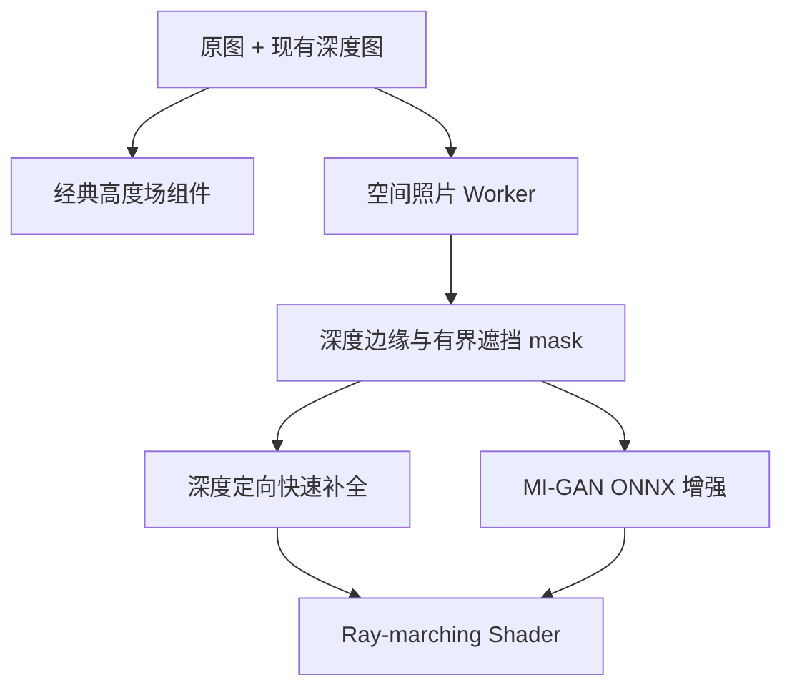

# 空间照片模式：调研与架构决策

## 目标与约束

- 保留现有深度图生成、上传和历史记录格式；
- 经典高度场模式保持可用，并能与空间照片模式随时切换；
- 照片处理在浏览器设备端完成；
- 首屏不能被 AI 模型下载阻塞；
- 移动端模型体积、GPU 内存和失败降级必须可控；
- 不引入许可证不兼容的源代码。

## 调研结论

### 3D Photo Inpainting

[3D Photography using Context-aware Layered Depth Inpainting](https://github.com/vt-vl-lab/3d-photo-inpainting) 证明了 RGB-D 输入、分层深度表示、遮挡区域补全与标准图形引擎实时渲染的组合是有效路线。其完整研究模型依赖旧版 PyTorch，并包含非商业许可的 EdgeConnect 部分，因此不适合直接移植到浏览器；本项目只采用其“显式处理 disocclusion”的架构思想。

### Inpaint Web 与 MI-GAN

[inpaint-web](https://github.com/lxfater/inpaint-web) 已验证 MI-GAN ONNX 能通过 WebGPU/WASM 完成纯浏览器 inpainting，但项目本身采用 GPL-3.0。本项目没有复制其代码，只参考了浏览器端 ONNX 推理已经可行这一事实。

[MI-GAN 官方实现](https://github.com/Picsart-AI-Research/MI-GAN) 使用 MIT License，目标就是移动设备 inpainting；官方 ONNX pipeline 接收 uint8 RGB 与二值 mask，并负责裁剪、缩放、融合和输出。当前 pipeline 模型约 28.1 MB，明显轻于扩散模型，适合作为空间照片的后台增强器。

### Depthy 与 DepthFlow

[Depthy](https://github.com/panrafal/depthy) 证明了基于深度图的浏览器 ray-marching 可以比直接旋转高度场更自然地处理视差。其实现较旧，但 MIT 许可且技术思路有效。

[DepthFlow](https://github.com/BrokenSource/DepthFlow) 展示了高质量 ray-marching、焦平面、相机 offset 与采样质量之间的关系，但采用 AGPL-3.0。本项目的 Shader 从投影关系独立实现，没有复制 DepthFlow 源码。

## 为什么不把分割模型设为依赖

空间照片渲染不要求一个完整、语义正确的前景 mask。需要的是深度不连续边缘以及最大相机移动会暴露的背景窄带，这些信息可以直接从现有深度图获得。

额外的通用分割或抠图模型存在以下代价：

- 典型浏览器模型还需增加约 26–110 MB 下载；
- 会与深度模型、inpainting 模型同时占用移动端推理内存；
- 人像抠图对肖像有效，但对建筑、动物、景观和多个遮挡层不稳定；
- 语义分割无法替代头发、玻璃等区域需要的 alpha matting。

因此当前实现采用可替换的 depth mask provider。未来若加入人物专用增强，应按需加载 portrait matting，并只用于修正边界，不应取代深度几何。

## 最终架构

### 生成阶段

- 输入最长边限制为 1280 像素；原图纹理仍以原始分辨率渲染；
- 正深度值沿用经典模式约定，数值越大视为越近；
- Sobel 式深度梯度定位遮挡边缘，并拒绝缓慢深度斜坡；
- 将远景表面量化为独立深度层，重叠遮挡只接受同层采样，并由最靠近相机的可见背景层取得目标像素，避免跨层颜色渗漏；
- mask 只向近景一侧扩展约短边的 4.5%，避免补完整个主体；
- 快速补全从边缘远景侧定向采样；
- AI 增强失败时保留快速结果；
- 模型使用 Cache API 缓存，补全背景与 mask 使用 IndexedDB 按历史记录缓存。

### 浏览阶段

- 最多 32 层深度采样，从近到远求解当前屏幕像素对应的原图位置；
- 使用近景偏置解决遮挡边界上的多解；
- 低置信度与深度突变区域渐进混合补全背景；
- overscan 隐藏虚拟相机移动产生的画布边缘；
- 鼠标拖动或设备方向传感器控制相机 offset，而不是旋转整张网格；
- 焦平面、视差强度与采样质量可调。

## 降级策略

| 能力 | 行为 |
|---|---|
| WebGPU + 模型可用 | MI-GAN WebGPU 补全 |
| 无 WebGPU | MI-GAN WASM 补全 |
| 模型下载或推理失败 | 深度定向快速补全 |
| 无明显深度边缘 | 使用原图作为背景 plate |
| 用户切回经典模式 | 卸载空间渲染器，经典设置保持不变 |

## 验收标准

- 旧版深度生成 Worker 不改变输入、输出和模型选项；
- 经典模式可以构建、交互、录制和导出；
- 空间模式首次进入能在 AI 完成前显示快速结果；
- AI 处理不上传照片，模型和输出可缓存；
- AI 失败不会导致空间模式不可用；
- 模式切换不重新生成深度图；
- 历史记录删除时同步删除空间资产；
- 纯算法测试、TypeScript 检查和生产构建通过。
